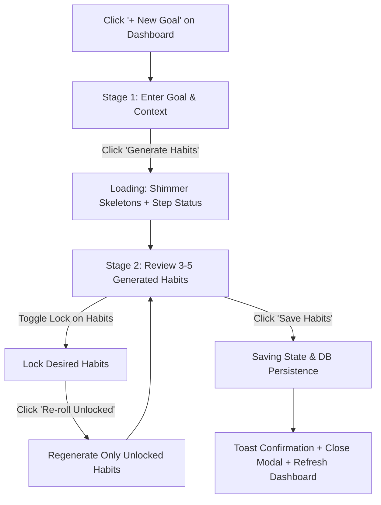

# Product Requirements Document (PRD)

**Product Name:** Routini  
**Document Title:** Goal Creation & AI Habit Selection Flow  
**Status:** Approved for Implementation  
**Version:** 1.0

---

## 1. Executive Summary & Vision

### 1.1 Product Vision

**Routini** is an AI-powered goal breakdown and habit-tracking platform designed to eliminate the cognitive friction and blank-canvas paralysis of building sustainable routines.

Instead of forcing users to manually map out habits, schedules, and milestones from scratch, Routini converts high-level ambitions (e.g., _"Learn TypeScript"_, _"Run a 5K marathon"_, _"Improve deep work"_) into 3–5 bite-sized, actionable daily habits in seconds.

### 1.2 Core Problem & Solution

- **Problem:** Users arrive with high motivation and clear high-level goals, but abandon setup because decomposing goals into daily executable habits requires high cognitive effort.
- **Solution:** A rapid, 2-step AI generation flow where users input an intention, receive tailored habit suggestions, pin/lock the ones they love, re-roll the rest, and instantly commit them to their dashboard.

---

## 2. Target Audience & Persona

- **Target User:** Goal-oriented individuals, builders, knowledge workers, and athletes who value speed, execution momentum, and structure.
- **Visitor Mode:** **Operate** — swift, focused, minimal visual noise, and high completion momentum.

---

## 3. Feature Scope & Boundaries

### 3.1 In Scope

1. **Two-Stage Modal Dialog**:
   - **Stage 1 (Goal Prompt):** Input goal title + optional contextual details.
   - **Stage 2 (Habit Review & Lock Board):** Stack of 3–5 generated habit cards with lock/unlock toggles and re-roll capabilities.
2. **Lock & Re-roll Mechanics**:
   - Pinned/locked habits remain preserved while unlocked cards re-roll upon requesting regeneration.
3. **Contextual Skeleton Loading**:
   - Animated shimmering skeletons paired with phased status indicators (_"Analyzing goal..."_ → _"Drafting actionable daily routines..."_).
4. **Instant Commit & Feedback**:
   - Single-click save action, Sonner toast notification, modal auto-dismiss, and immediate dashboard synchronization.
5. **Accessibility & Keyboard Navigation**:
   - Focus trapping, `Enter` submission on prompt, `Space`/`Enter` lock toggling, and `Esc` dismissal.

### 3.2 Explicit Anti-Goals (Out of Scope)

- ❌ No complex multi-day custom recurrence schedulers inside this modal (keep creation lightweight).
- ❌ No multi-step nested modals, wizard dialogs, or gamified confetti popups.
- ❌ No manual in-line habit editing during initial review (focus on fast curation via lock & re-roll).

---

## 4. User Journey & Interaction Flow

---

## 5. Detailed Functional Specifications

### 5.1 Stage 1: Goal Definition ([`form-view.tsx`](../components/create-goal-modal/form-view.tsx))

- **Primary Input:** Goal title field with rotating contextual placeholders (e.g., _"Learn TypeScript in 30 days"_, _"Run 5k marathon"_).
- **Nuance Textarea:** Optional context field for constraints or specific routines (e.g., _"Morning only, max 20 minutes/day"_).
- **CTA Button:** _"Generate Habits"_ button with enter-key trigger and client-side validation.

### 5.2 Loading & Step Indicator

- **Skeletons:** 3–4 pulsating card skeletons replicating the final card dimensions.
- **Smart Status Captions:**
  1. _"Analyzing your goal & constraints..."_
  2. _"Drafting actionable daily routines..."_
  3. _"Finalizing habit stack..."_

### 5.3 Stage 2: Habit Review & Lock Board ([`review-view.tsx`](../components/create-goal-modal/review-view.tsx))

- **Habit Card Stack ([`selectable-habit-card.tsx`](../components/create-goal-modal/selectable-habit-card.tsx)):**
  - Habit title, estimated daily duration, frequency, and brief impact statement.
  - **Padlock Affordance:** Lock/Unlock icon button with distinct visual states:
    - _Unlocked:_ Subtle outline icon, hover state indicates _"Lock to preserve"_.
    - _Locked:_ Solid highlighted badge/border indicating _"Locked - will keep on re-roll"_.
- **Sticky Action Bar:**
  - **Back Button:** Return to prompt to adjust goal parameters.
  - **Re-roll Button (`RefreshCw`):** Triggers re-generation for all unlocked habit slots while keeping locked cards frozen.
  - **Save & Commit Button:** Commits the goal and locked/approved habits to the database.

---

## 6. State Machine & Data Ranges

| State            | Modal View  | Card Stack Behavior                               | Primary CTA Status              |
| :--------------- | :---------- | :------------------------------------------------ | :------------------------------ |
| **Initial Form** | Prompt View | N/A                                               | Active (`"Generate Habits"`)    |
| **Generating**   | Review View | Full shimmer skeletons with status caption        | Disabled / Spinner              |
| **Review**       | Review View | 3–5 Interactive cards (Locked / Unlocked)         | Active (`"Save Habits"`)        |
| **Regenerating** | Review View | Locked cards frozen; unlocked show active shimmer | Disabled (`"Re-rolling..."`)    |
| **Saving**       | Review View | All cards disabled                                | Loading spinner (`"Saving..."`) |
| **Success**      | Dismissed   | Toast notification (`"Goal & habits created!"`)   | N/A                             |

---

## 7. Technical Architecture & Constraints

- **Framework & Runtime:** Next.js 16 (App Router), React 19.
- **Component Surface:** [`components/create-goal-modal/`](../components/create-goal-modal/)
  - [`create-goal-modal.tsx`](../components/create-goal-modal/create-goal-modal.tsx) (Orchestrator modal dialog)
  - [`form-view.tsx`](../components/create-goal-modal/form-view.tsx) (Stage 1 inputs)
  - [`review-view.tsx`](../components/create-goal-modal/review-view.tsx) (Stage 2 review board)
  - [`selectable-habit-card.tsx`](../components/create-goal-modal/selectable-habit-card.tsx) (Interactive habit card)
- **Design & UI System:** Tailwind CSS + [shadcn/ui](../components.json) (`Dialog`, `Button`, `Input`, `Textarea`, `Badge`, `Skeleton`).
- **Server Actions & API:** [`actions/habitActions.ts`](../actions/habitActions.ts)
  - `generateHabits(goal, nuance)`: Initial AI generation via OpenAI / AI provider.
  - `regenerateHabits(goal, lockedHabits, count)`: Re-rolls unlocked habits with context of existing locked items.
  - `saveGoalWithHabits(goalData, selectedHabits)`: Prisma transactional persistence to Postgres.
- **Notifications:** Sonner toast on commit and error handling.

---

## 8. Success Metrics (KPIs)

1. **Flow Completion Rate:** > 80% of opened modals resulting in committed goals.
2. **Time to Creation:** < 30 seconds from modal trigger to dashboard commit.
3. **Re-roll Engagement:** Average of 1–2 re-rolls per session, showing active curation without frustration.
4. **Day-7 Habit Retention:** > 40% habit check-in rate for AI-generated habits.
